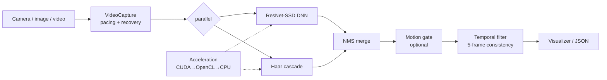

# Real-Time Face Tracking System


**Robust Real-Time Face Detection and Tracking with Advanced Error Recovery**

This comprehensive face tracking system combines traditional computer vision techniques with deep learning to achieve robust real-time performance. The implementation emphasizes error resilience, hardware acceleration support, and adaptive resource management, making it suitable for deployment across diverse environments. Built for stability rather than cutting-edge performance, it prioritizes error recovery over maximizing detection accuracy.

It runs three ways: as a **live webcam tracker**, a **headless CLI** over image/video files, or a **REST API microservice** (FastAPI + Docker) — all backed by a pytest + GitHub Actions CI suite.

## Contributors
- **Romil V. Shah** - Lead Developer ([LinkedIn](https://linkedin.com/in/romil2112))
- **Parshav A. Shah** - Assistant Developer ([GitHub](https://github.com/pshah0601) | [LinkedIn](https://www.linkedin.com/in/parshav-shah6102))


## Table of Contents
- [Key Features](#key-features)
- [Skills Demonstrated](#skills-demonstrated)
- [REST API](#rest-api)
- [Headless CLI](#headless-cli)
- [Docker](#docker)
- [Technical Architecture](#technical-architecture)
- [System Requirements](#system-requirements)
- [Installation](#installation)
- [Quick Start](#quick-start)
- [Configuration](#configuration)
- [Usage Guide](#usage-guide)
- [Error Recovery System](#error-recovery-system)
- [Privacy, Biometrics & Responsible Use](#privacy-biometrics--responsible-use)
- [Contributing](#contributing)
- [License](#license)
- [Legal Notice & Responsible Use](#️-legal-notice--responsible-use)

## Key Features

### Adaptive Detection Architecture
- Primary detector: Lightweight ResNet-SSD (300x300 resolution) for balance between speed and accuracy
- Fallback mechanism: Haar Cascade with dynamic parameter tuning (scale factor adjusts between 1.1–1.3 based on frame processing time)
- Automatic model fallback with health monitoring
- Temporal consistency validation: 5-frame buffer to confirm face presence before updating tracking coordinates

### Hardware Optimization
- Automatic backend selection walks `CUDA → OpenCL → CPU` and picks the first available accelerator
- **CUDA** uses the dedicated `cv2.dnn` CUDA backend (NVIDIA GPUs)
- **OpenCL** uses the OpenCV T-API (`cv2.UMat`) so DNN inference, colour conversion, and Haar detection run on the GPU on any OpenCL device (Intel / AMD / Apple)
- **CPU** is the always-available fallback
- Dynamic resource management (1-5 frame skip)
- Memory-optimized processing pipeline

### Fault Tolerance
- Three-stage error recovery system:
  1. GPU memory exhaustion / CUDA unavailable → fall through `CUDA → OpenCL → CPU`
  2. Camera timeout → Hardware reset via USB power cycle emulation
  3. Model corruption → Local cache restoration from embedded weights
- Circuit breakers for critical subsystems
- Graceful degradation under load

## Skills Demonstrated

| Area | Details |
|---|---|
| Real-Time Systems | Frame-by-frame processing pipeline with dynamic 1–5 frame skipping and adaptive resource management to hold real-time FPS under load |
| Computer Vision / Deep Learning | Hybrid detector — ResNet-SSD (300×300) DNN with Haar Cascade fallback, Non-Maximum Suppression, and optical-flow motion analysis |
| Fault Tolerance | Three-stage recovery (CUDA OOM → OpenCL → CPU, camera timeout → reset, model corruption → cache restore), circuit breakers, and retry with exponential backoff + jitter |
| Hardware Acceleration | `CUDA → OpenCL → CPU` backend auto-selection driven by a pure, unit-tested priority resolver; OpenCL path uses the OpenCV T-API (`cv2.UMat`) for GPU offload, with graceful CPU degradation |
| Software Engineering | Modular architecture (detection, capture, temporal filtering, error handling, visualization), centralized config, and a CLI argument interface |
| Backend / REST API | FastAPI service exposing `POST /detect` (image upload → JSON faces) and `GET /health`, decoding images in-memory with OpenCV |
| Containerization | Dockerfile packaging the detection service for headless deployment (`docker build` → `uvicorn`) |
| Testing / CI | 52 pytest unit/integration tests (detection logic, NMS, temporal filtering, circuit breakers, REST API, acceleration selection) run on Python 3.10–3.12 via GitHub Actions |

## REST API

Run the detector as a headless HTTP service (no camera or display required):

```bash
pip install -r requirements-api.txt
uvicorn src.api:app --host 0.0.0.0 --port 8000
```

| Method | Path | Description |
|--------|------|-------------|
| `GET`  | `/health` | Liveness probe → `{"status": "ok"}` |
| `POST` | `/detect` | Multipart image upload → `{"count": N, "faces": [{rect, center, confidence}]}` |

```bash
curl -X POST http://localhost:8000/detect -F "file=@face.jpg"
# {"count": 1, "faces": [{"rect": [120, 80, 90, 90], "center": [165, 125], "confidence": 0.99}]}
```

Interactive docs are auto-generated at `http://localhost:8000/docs`.

## Headless CLI

Process an image or video file directly, with no webcam:

```bash
python src/cli_detect.py --image face.jpg --json            # print detections as JSON
python src/cli_detect.py --image face.jpg --out annotated.jpg   # write an annotated image
python src/cli_detect.py --video clip.mp4 --json            # per-frame detection counts
```

## Docker

```bash
docker build -t face-detection-api .
docker run -p 8000:8000 face-detection-api
```

## Technical Architecture

### Detection Pipeline

Each frame runs the DNN and Haar detectors in parallel, merges and de-duplicates
the results with NMS, optionally gates them by motion, and smooths across frames
with the temporal filter before drawing. A circuit-breaker/retry layer wraps the
camera and detectors so a transient failure degrades (CUDA → OpenCL → CPU, frame
skipping) instead of crashing.



### Core Components
├── haarcascade_frontalface_default.xml  
├── LICENSE  
├── README.md  
├── requirements.txt  
└── src/    
* ├── main.py                     # Main application entry point
* ├── face_detector.py           # Hybrid DNN + Haar Cascade detection
* ├── acceleration.py            # CUDA → OpenCL (T-API) → CPU backend selection
* ├── video_capture.py           # Camera interface with error recovery
* ├── temporal_filter.py         # 5-frame temporal consistency checks
* ├── error_handling.py          # Circuit breakers & recovery system
* ├── motion_utils.py            # Optical flow-based motion analysis
* ├── tracking_visualizer.py     # BBox/FPS visualization
* ├── nms_utils.py               # Non-Maximum Suppression
* ├── config.py                  # Centralized configuration
* ├── __init__.py
* └── models/
  * ├── deploy.prototxt                   # DNN architecture
  * └── res10_300x300_ssd_iter_140000.caffemodel  # Pre-trained weights  

## System Requirements

| Component | Minimum | Recommended |
|-----------|---------|-------------|
| Processor | Intel i5 8th Gen | Intel i7 11th Gen/NVIDIA GPU |
| RAM       | 8GB     | 16GB        |
| Storage   | 500MB   | 1GB SSD     |
| OS        | Windows 10 | Ubuntu 22.04 |
| Camera    | 720p Webcam | 1080p USB3.0 |

## Installation

Prerequisites
- Python 3.10+
- OpenCV 4.5+ with contrib modules
- CUDA Toolkit 11.0+ + NVIDIA GPU (optional — for the CUDA backend)
- Any OpenCL device — Intel / AMD / Apple GPU (optional — for the OpenCL/T-API backend; no NVIDIA required)
- Neither is required: the system falls back to CPU automatically

1. Clone this repository:
git clone https://github.com/Romil2112/Face-Tracking-System.git
cd Face-Tracking-System

2. Install the required dependencies:
pip install -r requirements.txt

3. Ensure you have the `haarcascade_frontalface_default.xml` file in the root directory of the project.

## Quick Start

1. git clone https://github.com/Romil2112/Face-Tracking-System.git
2. cd Face-Tracking-System
3. pip install -r requirements.txt
4. python src/main.py --width 800 --height 600

## Configuration
You can modify various parameters in the `config.py` file to adjust the application's behavior.

### Environment Variables
All optional — the app runs with sensible defaults if none are set.

| Variable | Default | Purpose |
|---|---|---|
| `MAX_UPLOAD_BYTES` | `10485760` (10 MiB) | Max accepted image size on the API `POST /detect` |
| `OPENCV_OCL_CACHE_DIR` | `<tempdir>/ocl_cache` | Directory for OpenCL's compiled-kernel cache |
| `OPENCV_OPENCL_DEVICE` | `:GPU:0` | OpenCL device selector (any platform, first GPU) |

## Usage Guide
To run the application:

1. Navigate to the `src` folder:
cd src

2. Run the main script:
python main.py

Optional command-line arguments:
- `--camera`: Camera index (default: 0)
- `--width`: Camera width (default: 640)
- `--height`: Camera height (default: 480)
- `--cascade`: Path to Haar cascade XML file
- `--scale-factor`: Scale factor for face detection
- `--min-neighbors`: Min neighbors for face detection
- `--max-faces`: Maximum number of faces to track
- `--debug`: Enable debug output

## Error Recovery System:
Three-tier fault tolerance mechanism:
1. Retry Decorator: Exponential backoff with jitter (3 attempts)
2. Circuit Breakers: State tracking for camera/detector subsystems
3. Graceful Degradation:
  - Dynamic frame skipping
  - Model complexity reduction
  - CUDA → OpenCL → CPU fallback

## Privacy, Biometrics & Responsible Use

This is a **free and open-source demonstration / trial project**, not a certified commercial
biometric platform.

### Biometric data disclosure
Face detection processes **biometric-related data** (images of human faces). Depending on
where you and your data subjects are located, this may be regulated by laws including:

- **Illinois Biometric Information Privacy Act (BIPA)**
- **Texas** Capture or Use of Biometric Identifier Act (**CUBI**)
- **Washington** biometric privacy law (HB 1493)
- **GDPR Article 9** (special-category data) in the EU/EEA
- **PIPEDA** in Canada, and other equivalent regimes

You are responsible for determining which laws apply and for obtaining any **legally required
notice and consent** before processing images of identifiable people.

### Data retention
The **REST API processes images entirely in memory** — uploaded images are decoded, analyzed,
and discarded as the response is built. **No image data is stored.** Every API response
includes the header:

```
X-Data-Retention: no image data stored; processed in-memory only
```

The webcam tracker renders to a display window only. The headless CLI writes an annotated
image **only** when you explicitly pass `--out`; otherwise it persists nothing.

### Authorized & responsible use
- Use this software only with **images or video you own or are authorized to process**.
- Do **not** use it to monitor, track, identify, or surveil people **unlawfully**, or without
  legally required notice/consent.
- The `/detect` endpoint must only be used where the operator holds all required rights.
- Provided **as-is, with no warranty** and **no liability for misuse**.

## Contributing

1. Fork the repository
2. Create feature branch:
git checkout -b feature/improvement
3. Commit changes following [Semantic Commit](https://www.conventionalcommits.org) guidelines
4. Submit pull request with:
- Unit tests
- Updated documentation
- Performance benchmarks

## License
This project is licensed under the terms of the [LICENSE](https://github.com/Romil2112/Face-Tracking-System/blob/main/LICENSE) file included in this repository (MIT).

## ⚖️ Legal Notice & Responsible Use

This project is **free and open-source software**, released under the **MIT License** as a
**demonstration / learning / trial project**. It is provided **"as is", without warranty of
any kind**, and is **not an audited or certified commercial biometric product**.

- **Authorized use only.** Use it solely with images, video, and devices that you own or are
  **explicitly authorized** to process.
- **Do no harm.** Do not use it to surveil, stalk, harass, invade the privacy of, or conduct
  unauthorized monitoring or identification of any person.
- **Consent & notice.** Facial detection processes biometric-related data; obtaining any
  legally required notice and consent is the operator's responsibility.
- **Compliance is the operator's responsibility.** Compliance with **BIPA, CUBI, Washington
  HB 1493, GDPR (incl. Article 9), PIPEDA, CCPA**, and equivalent laws — where applicable —
  rests with the operator.
- **Misuse may be illegal.** Unauthorized monitoring or biometric processing may violate
  privacy, biometric, and computer-misuse laws in your jurisdiction.

By using this software you accept responsibility for operating it lawfully. See
[SECURITY.md](SECURITY.md) to report a vulnerability.
