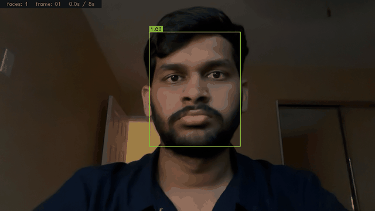
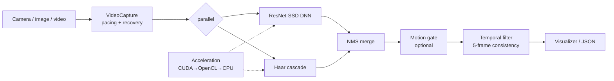

# Real-time face tracking

Real-time face tracking is a computer-vision service that detects and tracks faces in a webcam stream, in image or video files, or over an HTTP API. It runs a ResNet-SSD network and a Haar cascade together, smooths detections across frames, and keeps running when a camera or GPU backend fails instead of crashing. It returns face boxes with center points and confidence scores as JSON, or draws them on a live or annotated frame. I built it with Parshav.

## Demo

Real-time face detection demo — live webcam feed with bounding boxes, confidence scores, and frame-by-frame detection status:



## How it works

Each frame goes through two detectors at once. The ResNet-SSD network is accurate on frontal faces but misses some at sharp angles; the Haar cascade picks up a different set. Their boxes are merged with non-maximum suppression, which also drops the duplicate overlapping boxes so one face is reported once. A motion gate and a temporal filter follow: the temporal filter holds a candidate across a 5-frame window and only reports it once it shows up consistently, which clears out most one-frame false positives before they reach the output.

Detection picks a backend at startup and falls back on failure. It tries CUDA first; if there is no NVIDIA GPU or the CUDA backend fails to initialize, it drops to OpenCL through OpenCV's T-API, which runs on Intel, AMD, or Apple GPUs; if that is unavailable it runs on CPU. A circuit-breaker and retry layer wraps the camera and detectors, so a transient failure degrades (backend fallback, frame skipping) instead of stopping the stream. The detectors come from OpenCV, and `requirements` pins opencv below 5 because OpenCV 5.x breaks initialization of the bundled ResNet-SSD and Haar models, so on 5.x detection never starts.

Writing tests for the camera-failure path turned up a real bug: the recovery code called `ErrorHandler.handle_camera_error` without an instance bound to it, so every camera failure raised an `AttributeError` instead of resetting the camera. The fix gave the capture loop its own `ErrorHandler` instance, and the test that caught it forces a camera failure and checks that recovery runs.

## Features

- Hybrid detector: ResNet-SSD (300x300) DNN plus Haar cascade, merged with NMS
- 5-frame temporal filter for stable tracking and fewer one-frame false positives
- Optical-flow motion gate (optional)
- Hardware backend auto-selection: CUDA → OpenCL (T-API) → CPU
- Circuit-breaker and exponential-backoff retry around the camera and detectors
- Camera reconnect and DNN-to-Haar detector fallback on failure
- FastAPI service: `POST /detect` (image upload → JSON faces) and `GET /health`
- Headless CLI over image and video files, plus a live webcam tracker
- Adaptive 1–5 frame skipping under load
- opencv pinned below 5 (5.x breaks the bundled detector initialization)
- 204 pytest tests at 96% line / 93% branch coverage on Python 3.10–3.12

## Running the Project

**Prerequisites:** Python 3.10–3.12 and OpenCV 4.x (`requirements.txt` pins opencv below 5 because 5.x breaks the bundled detector initialization). A CUDA or OpenCL GPU is optional; without one it runs on CPU.

### Option A — HTTP API with Docker (recommended)

```bash
docker build -t face-detection-api .
docker run -p 8000:8000 face-detection-api
```

Test the API:

```bash
curl http://localhost:8000/health
# {"status":"ok"}

curl -X POST http://localhost:8000/detect -F "file=@your_photo.jpg"
# {"count": 1, "faces": [{"rect": [142, 88, 95, 95], "center": [189, 135], "confidence": 0.99}]}
```

Interactive API docs are auto-generated at <http://localhost:8000/docs>.

### Option B — HTTP API locally

```bash
python3 -m venv .venv
source .venv/bin/activate        # Windows: .venv\Scripts\activate
pip install -r requirements-api.txt
uvicorn src.api:app --port 8000
```

### Option C — Live webcam tracker

Requires a connected camera and full dependencies:

```bash
python3 -m venv .venv
source .venv/bin/activate
pip install -r requirements.txt
python src/main.py --width 1280 --height 720
# press Q to quit
```

The tracker auto-selects the fastest available backend at startup (CUDA → OpenCL → CPU) and prints which one it chose.

### Option D — Headless CLI (image or video file, no server)

```bash
python src/cli_detect.py --image portrait.jpg --output result.jpg
```

## API reference

| Method | Path | Description |
|--------|------|-------------|
| `GET`  | `/health` | Liveness probe → `{"status": "ok"}` |
| `POST` | `/detect` | Multipart image upload → `{"count": N, "faces": [{rect, center, confidence}]}` |

```bash
curl -X POST http://localhost:8000/detect -F "file=@face.jpg"
# {"count": 1, "faces": [{"rect": [120, 80, 90, 90], "center": [165, 125], "confidence": 0.99}]}
```

Interactive API docs are generated at `http://localhost:8000/docs`.

## Architecture diagram

Each frame runs the DNN and Haar detectors in parallel, merges and de-duplicates the results with NMS, optionally gates them by motion, and smooths across frames with the temporal filter before drawing. A circuit-breaker/retry layer wraps the camera and detectors so a transient failure degrades (CUDA → OpenCL → CPU, frame skipping) instead of crashing.



## Tests

204 pytest tests cover the detection logic, NMS, temporal filtering, optical-flow motion analysis, the circuit breaker and recovery paths (including the camera-failure bug above), backend selection, the REST API, and the CLI, at 96% line and 93% branch coverage. They are hermetic: no camera or display is needed, and cv2's GUI and capture calls are mocked. CI runs them on Python 3.10, 3.11, and 3.12. Run them locally with:

```bash
python -m pytest tests/ -v
```

## Privacy, Biometrics & Responsible Use

This is a **free and open-source demonstration / trial project**, not a certified commercial
biometric platform.

### Biometric data disclosure
Face detection processes **biometric-related data** (images of human faces). Depending on
where you and your data subjects are located, this may be regulated by laws including:

- **Illinois Biometric Information Privacy Act (BIPA)**
- **Texas** Capture or Use of Biometric Identifier Act (**CUBI**)
- **Washington** biometric privacy law (HB 1493)
- **GDPR Article 9** (special-category data) in the EU/EEA
- **PIPEDA** in Canada, and other equivalent regimes

You are responsible for determining which laws apply and for obtaining any **legally required
notice and consent** before processing images of identifiable people.

### Data retention
The **REST API processes images entirely in memory** — uploaded images are decoded, analyzed,
and discarded as the response is built. **No image data is stored.** Every API response
includes the header:

```
X-Data-Retention: no image data stored; processed in-memory only
```

The webcam tracker renders to a display window only. The headless CLI writes an annotated
image **only** when you explicitly pass `--out`; otherwise it persists nothing.

### Authorized & responsible use
- Use this software only with **images or video you own or are authorized to process**.
- Do **not** use it to monitor, track, identify, or surveil people **unlawfully**, or without
  legally required notice/consent.
- The `/detect` endpoint must only be used where the operator holds all required rights.
- Provided **as-is, with no warranty** and **no liability for misuse**.

## ⚖️ Legal Notice & Responsible Use

This project is **free and open-source software**, released under the **MIT License** as a
**demonstration / learning / trial project**. It is provided **"as is", without warranty of
any kind**, and is **not an audited or certified commercial biometric product**.

- **Authorized use only.** Use it solely with images, video, and devices that you own or are
  **explicitly authorized** to process.
- **Do no harm.** Do not use it to surveil, stalk, harass, invade the privacy of, or conduct
  unauthorized monitoring or identification of any person.
- **Consent & notice.** Facial detection processes biometric-related data; obtaining any
  legally required notice and consent is the operator's responsibility.
- **Compliance is the operator's responsibility.** Compliance with **BIPA, CUBI, Washington
  HB 1493, GDPR (incl. Article 9), PIPEDA, CCPA**, and equivalent laws — where applicable —
  rests with the operator.
- **Misuse may be illegal.** Unauthorized monitoring or biometric processing may violate
  privacy, biometric, and computer-misuse laws in your jurisdiction.

By using this software you accept responsibility for operating it lawfully. See
[SECURITY.md](SECURITY.md) to report a vulnerability.

## License

MIT — see [LICENSE](LICENSE).
